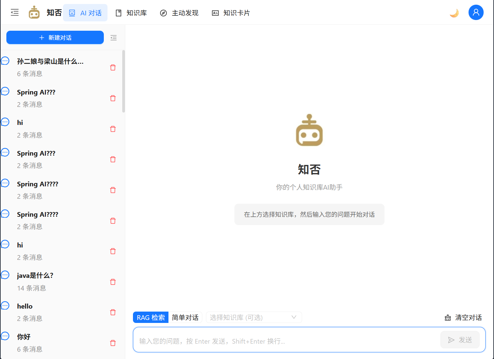
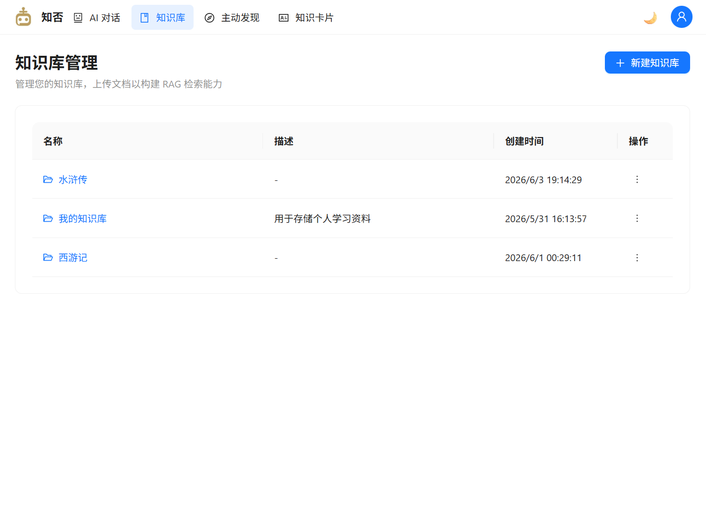
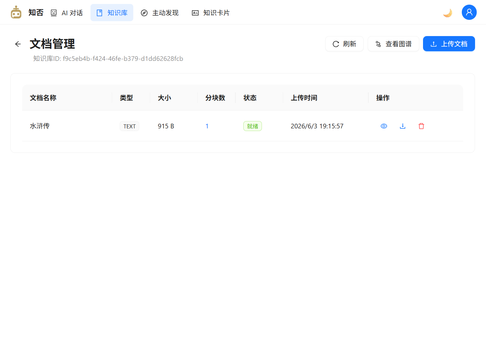
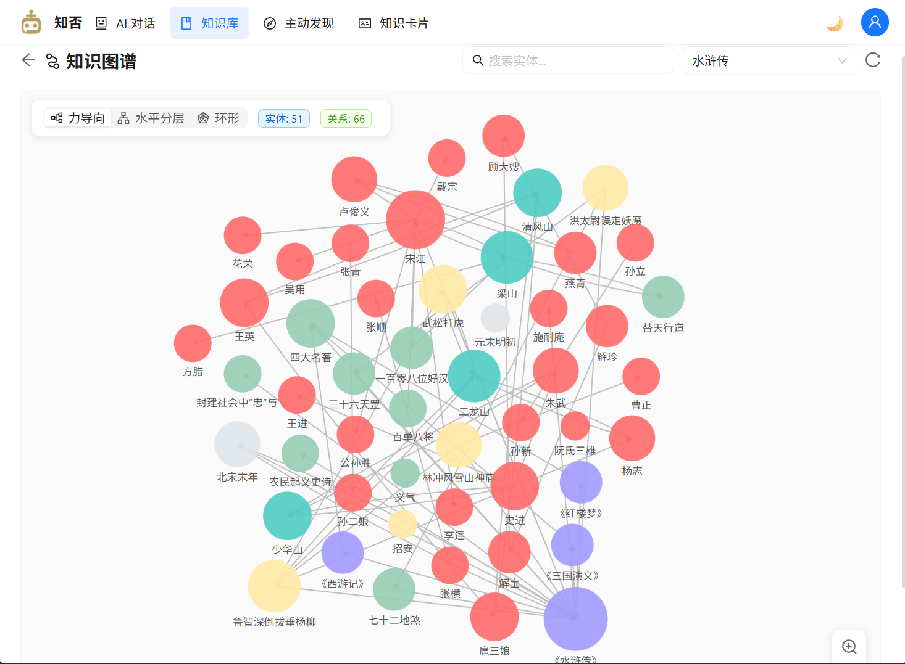
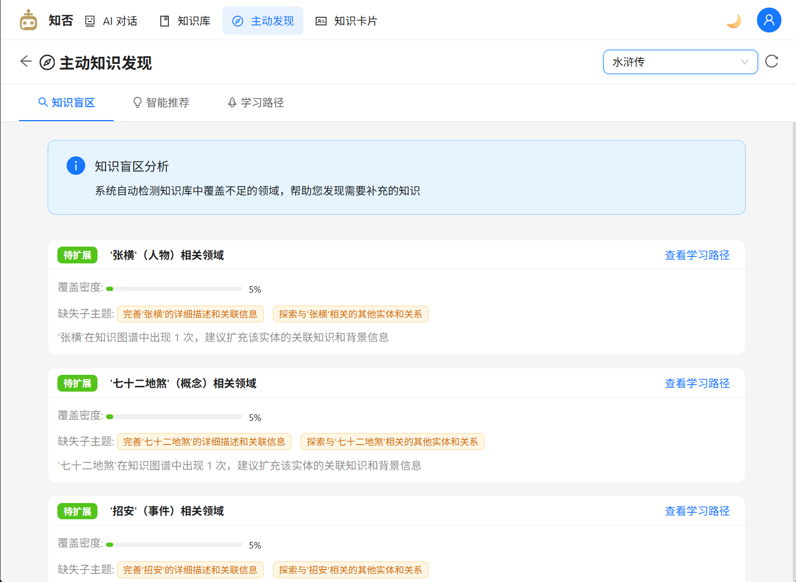

# KnowledgeForge AI

基于 Spring AI 的个人知识库 RAG 智能问答系统，支持知识图谱可视化、可信度溯源和增量学习。

## 项目简介

AI-Knowledge-Base是一款面向个人知识管理的 RAG 问答系统。用户上传文档后，系统自动进行语义分块、向量化存储，并通过 AI 大模型提供基于私有知识库的精准问答。系统还支持知识图谱构建与可视化、知识卡片审核管理、对话式知识沉淀等高级功能。

## 核心特性

### 已实现功能

- **RAG 智能问答**：基于用户私有知识库的流式 (SSE) 对话，支持多知识库检索
- **知识库管理**：创建/编辑/删除知识库，独立隔离不同领域的知识
- **文档管理**：支持 PDF、Word、Markdown、TXT 格式上传，自动语义分块与向量化
- **知识图谱可视化**：自动抽取实体关系构建图谱，支持力导向/分层/环形三种布局，Web Worker 异步计算，贝塞尔曲线边线渲染
- **知识卡片审核**：对话完成后自动提取关键知识点，支持单张/批量审核，审核通过自动同步向量库和图谱
- **可信度溯源**：每个回答附带来源追溯链，标明所属文档和段落
- **服务状态监控**：前端 Axios 拦截器监听服务健康状态，服务不可用时显示醒目提示

### 核心能力

| 维度   | 说明                    |
| ---- | --------------------- |
| 检索引擎 | pgvector 向量语义检索       |
| 知识组织 | 知识图谱实体关系网络            |
| 文档分块 | 自适应语义分块（按标题层级 + 段落边界） |
| 可信度  | 来源追溯链 + 多维度可信度评分      |
| 知识增长 | 手动上传 + 对话增量沉淀         |
| 可视化  | 力导向 / 水平分层 / 环形三种布局   |

## 系统截图

### RAG 智能问答



### 知识库管理



### 文档管理



### 知识图谱可视化



### 知识卡片审核



## 技术栈

### 后端

| 技术          | 版本            | 用途          |
| ----------- | ------------- | ----------- |
| Java        | 21            | 开发语言        |
| Spring Boot | 3.4.x         | 应用框架        |
| Spring AI   | 1.0.0 (GA)    | AI 集成框架     |
| PostgreSQL  | 16 + pgvector | 业务数据 + 向量存储 |
| MinIO       | 最新稳定版         | 文件对象存储      |
| Flyway      | -             | 数据库版本管理     |
| Maven       | -             | 项目构建        |

### 前端

| 技术           | 版本  | 用途       |
| ------------ | --- | -------- |
| React        | 18  | UI 框架    |
| Ant Design   | 5.x | 组件库      |
| TypeScript   | 5.x | 类型安全     |
| Vite         | 6.x | 构建工具     |
| D3.js        | 7.x | 知识图谱可视化  |
| React Router | 6.x | 前端路由     |
| Axios        | 1.x | HTTP 客户端 |

## 项目结构

```
knowledge-forge/
├── knowledge-forge-core/        # 核心实体与共享模块
├── knowledge-forge-system/      # 主业务系统（Spring Boot）
│   ├── src/main/java/.../chat/      # 对话功能（RAG问答、流式对话）
│   ├── src/main/java/.../knowledge/ # 知识库管理（文档上传、分块、检索）
│   ├── src/main/java/.../knowledgecard/ # 知识卡片（审核、增量学习）
│   ├── src/main/java/.../graph/     # 知识图谱（实体抽取、图谱构建）
│   ├── src/main/java/.../config/    # 全局配置（AI、MinIO、异常处理）
│   └── src/main/resources/db/migration/ # Flyway 数据库迁移脚本
├── knowledge-forge-ui/          # 前端应用（React + Vite）
│   ├── src/pages/Chat/          # 对话页面
│   ├── src/pages/KnowledgeBase/ # 知识库管理
│   ├── src/pages/Document/      # 文档管理
│   ├── src/pages/Graph/         # 知识图谱可视化
│   ├── src/pages/Discovery/     # 知识发现
│   ├── src/pages/KnowledgeCard/ # 知识卡片审核
│   └── src/services/            # API 服务层
├── knowledge-forge-bom/         # BOM 统一依赖管理
├── doc/                         # 项目文档
│   └── KnowledgeForge-AI-设计文档.md  # 系统设计文档
├── env/                         # 环境配置
│   └── docker-compose.yml       # Docker 容器编排
└── pom.xml                      # 根 Maven 配置
```

## 快速启动

### 环境要求

- JDK 21
- Node.js 18+
- Docker（用于 PostgreSQL + MinIO）
- Maven 3.9+

### 1. 启动依赖服务

```bash
cd env
docker-compose up -d
```

### 2. 配置 LLM 与本地环境变量

```bash
# 复制配置模板
cp knowledge-forge-system/src/main/resources/llm.yml.example \
   knowledge-forge-system/src/main/resources/llm.yml
```

`application.yml` 会加载可选的 `llm.yml`，其中 AI 配置通过环境变量读取；数据库与 MinIO 也通过环境变量注入：

- 必填：`PG_PASSWORD`、`MINIO_ACCESS_KEY`、`MINIO_SECRET_KEY`、`AI_API_KEY`
- 可选默认值：`AI_BASE_URL`、`AI_CHAT_MODEL`、`AI_EMBEDDING_MODEL`
- 推荐直接复制仓库根目录下的 `.env.example` 为本地 `.env`，再按实际环境填写

```bash
# Windows PowerShell
$env:PG_PASSWORD="<your-db-password>"
$env:MINIO_ACCESS_KEY="<your-minio-access-key>"
$env:MINIO_SECRET_KEY="<your-minio-secret-key>"
$env:AI_API_KEY="<your-ai-api-key>"

# Linux / macOS
export PG_PASSWORD="<your-db-password>"
export MINIO_ACCESS_KEY="<your-minio-access-key>"
export MINIO_SECRET_KEY="<your-minio-secret-key>"
export AI_API_KEY="<your-ai-api-key>"
```

### 3. 启动后端

```bash
cd knowledge-forge-system
mvn spring-boot:run
```

### 4. 启动前端

```bash
cd knowledge-forge-ui
npm install
npm run dev
```

访问 <http://localhost:3000> 即可使用。

## 与 know-hub-ai 的对比

[know-hub-ai](https://github.com/NingNing0111/know-hub-ai) 是 Spring AI + RAG 的优质学习项目，KnowledgeForge AI 在其基础上进行了深度扩展和创新。

| 对比维度      | know-hub-ai    | **KnowledgeForge AI（本项目）**   |
| --------- | -------------- | ---------------------------- |
| **检索策略**  | 纯向量语义检索        | 向量语义检索 + 知识图谱查询扩展            |
| **知识组织**  | 知识库文件夹式隔离      | **知识图谱实体关系网络**               |
| **文档分块**  | Spring AI 默认分块 | **自适应语义分块**（标题层级 + 段落边界）     |
| **可信度**   | 无评分机制          | **知识可信度溯源**（来源追溯链 + 多维度评分）   |
| **知识增长**  | 纯手动上传          | 手动上传 + **对话增量沉淀**（知识卡片审核）    |
| **知识图谱**  | 无              | **实体关系自动抽取 + 三种布局可视化**       |
| **可视化管理** | 基础列表展示         | **知识图谱可视化** + 知识卡片审核面板       |
| **服务监控**  | 无              | 前端服务不可用状态提示                  |
| **多模态**   | 支持（图片+文档）      | 暂不聚焦多模态                      |
| **基础设施**  | PG + MinIO     | PG + MinIO（架构预留 ES/Neo4j 扩展） |
| **前端框架**  | React + Umi.js | React + Vite + Ant Design 5  |
| **项目定位**  | Spring AI 学习项目 | 生产级个人知识库系统                   |

### 差异化创新点

1. **知识图谱增强检索**：自动抽取实体关系，构建知识网络，检索时通过图谱扩展关联实体
2. **自适应语义分块**：按文档标题层级 + 段落语义完整性动态分块，保留上下文完整
3. **可信度溯源**：每个回答标注来源文档、段落和相似度分数，支持多维度可信度评分
4. **增量学习**：对话中产生的新知识自动提取为知识卡片，用户审核后入库
5. **知识图谱可视化**：力导向/水平分层/环形三种布局，Web Worker 异步计算，贝塞尔曲线边线

## API 接口

### 知识库管理

| 方法     | 路径                             | 说明        |
| ------ | ------------------------------ | --------- |
| POST   | `/api/v1/knowledge-bases`      | 创建知识库     |
| GET    | `/api/v1/knowledge-bases`      | 知识库列表（分页） |
| GET    | `/api/v1/knowledge-bases/{id}` | 知识库详情     |
| PUT    | `/api/v1/knowledge-bases/{id}` | 更新知识库     |
| DELETE | `/api/v1/knowledge-bases/{id}` | 删除知识库     |

### 文档管理

| 方法     | 路径                                         | 说明   |
| ------ | ------------------------------------------ | ---- |
| POST   | `/api/v1/knowledge-bases/{kbId}/documents` | 上传文档 |
| GET    | `/api/v1/knowledge-bases/{kbId}/documents` | 文档列表 |
| GET    | `/api/v1/documents/{id}`                   | 文档详情 |
| DELETE | `/api/v1/documents/{id}`                   | 删除文档 |

### 对话

| 方法   | 路径                           | 说明             |
| ---- | ---------------------------- | -------------- |
| POST | `/api/v1/chat`               | RAG 问答（非流式）    |
| POST | `/api/v1/chat/rag/stream`    | RAG 流式问答 (SSE) |
| POST | `/api/v1/chat/conversations` | 创建对话           |
| GET  | `/api/v1/chat/conversations` | 对话列表           |

### 知识卡片

| 方法     | 路径                                     | 说明      |
| ------ | -------------------------------------- | ------- |
| GET    | `/api/v1/knowledge-cards`              | 卡片列表    |
| PUT    | `/api/v1/knowledge-cards/{id}/review`  | 审核卡片    |
| POST   | `/api/v1/knowledge-cards/batch-review` | 批量审核    |
| POST   | `/api/v1/knowledge-cards/extract`      | 从对话提取知识 |
| DELETE | `/api/v1/knowledge-cards/{id}`         | 删除卡片    |

### 知识图谱

| 方法  | 路径                              | 说明     |
| --- | ------------------------------- | ------ |
| GET | `/api/v1/graph/{kbId}`          | 获取图谱数据 |
| GET | `/api/v1/graph/{kbId}/entities` | 实体列表   |
| GET | `/api/v1/graph/{kbId}/search`   | 搜索实体   |
| GET | `/api/v1/graph/expand-query`    | 图谱查询扩展 |

## 文档

- [系统设计文档](doc/KnowledgeForge-AI-设计文档.md) — 完整架构设计、模块说明、API 设计

## 验证

建议以以下命令作为本地与 CI 的统一校验入口：

- **后端编译与测试**：`mvn test`
- **前端 Lint**：`npm run lint`
- **前端类型检查**：`npm run typecheck`
- **前端构建**：`npm run build`
- **前端格式检查**：`npm run format:check`

## License

MIT
